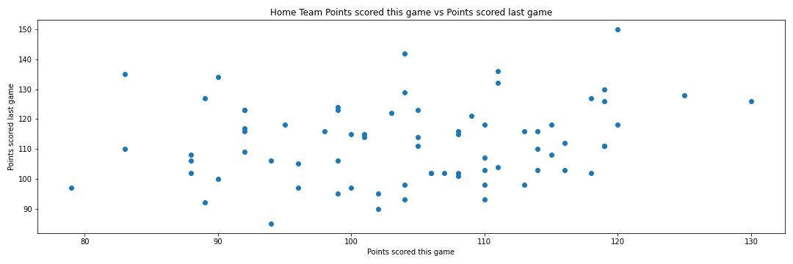

 

# **Capstone: ML Sportsbetting**
---
## Problem Statement
---
With the unpredictability of sports, there is never a sure-fire winning sports bet. The goal of this project is to create a model that returns the expected totals of upcoming NBA matchups and compares that to Over/Under bets from different sportsbooks, recommending whether the total will fall within the over or under line and by how much. Ultimately giving players somewhat of an analysis and upper hand when betting on sportsbooks. To create the expected value for the total of the game, we will be implementing machine learning models on previous NBA game data. Choosing the model with the best testing score.

## Background
---
With the rise of sports betting legalization by states, there has been an uptrend in users using sports betting apps and the number of sports betting apps in recent years. The sports betting market has grown significantly in the past few years, with a 2019 total revenue of around \\$1 billion, 2020 total revenue of around \\$1.5 billion, 2021 total revenue at \\$4.3 billion, and 2022 total revenue at around \\$5.4 billion according to [sportshandle](https://sportshandle.com/sports-betting-revenue/). The revenue continues to grow year by year with more growth to come as even more states are legalizing sports betting. The leaders in the online sports betting market are: [FanDuel](https://www.fanduel.com) and [DraftKings](https://www.draftkings.com), with FanDuel having more than 40% of the market share and DraftKings over 20% according to [igamingnext](https://igamingnext.com/news/july-us-sports-betting-market-monitor-fanduel-in-control-with-47-of-national-market-share/).

Transitioning to bets offered, there are three bet types for team-based sports: money lines, spread, and totals (over/under). Over/Under bets are bets placed targeting the total score of the game. For example, if the total line is set at 99.5, the over bet will win if the total of the game ends at 100, and the under will win if the total is 99 or less.  

Additional information of the market and betting can be found below:

[Yahoo Sportsbetting Beginner's Guide](https://sports.yahoo.com/sportsbook/howto/)

[ActionNetwork: State Legality](https://www.actionnetwork.com/news/legal-sports-betting-united-states-projections)

[LegalSportsReport: Over/Under](https://www.legalsportsreport.com/sports-betting/over-under/)

[LegalSportsReport: Sportsbetting Revenue](https://www.legalsportsreport.com/sports-betting/revenue/)

[FanDuel: Company Info](./sportsbook_info/FanDuel.md)

[DraftKings: Company Info](./sportsbook_info/DraftKings.md)

## Data Dictionary
---
|Feature|Type|Dataset|Description|
|---|---|---|---|
|home_team|object|matchups|abbreviation of home team|
|away_team|object|matchups|abbreviation of away team|
|point|float64|matchups|over/under line on sportsbook|
|date_game|datetime64|team1data|date of the game|
|pts|int64|team1data|points scored that game by the team|
|last1sum_pts|int64|team1data|points scored last game by the team|
|last1sum_fg|int64|team1data|field goals scored last game by the team|
|last1sum_fga|int64|team1data|field goals attempted last game by the team|
|last1sum_fg_pct|float64|team1data|field goal percentage last game by the team|
|last1sum_fg3|int64|team1data|3-point field goals scored last game by the team|
|last1sum_fg3a|int64|team1data|3-point field goals attempted last game by the team|
|last1sum_fg_pct|float64|team1data|3-point field goal perecentage last game by the team|
|last1sum_ft|int64|team1data|free throws scored last game by the team|
|last1sum_fta|int64|team1data|free throws attempted last game by the team|
|last1sum_ft_pct|float64|team1data|free throw percentage last game by the team|
|last1sum_trb|int64|team1data|total rebounds last game by the team|
|last1sum_ast|int64|team1data|total assists last game by the team|
|last1sum_stl|int64|team1data|total steals last game by the team|
|last1sum_blk|int64|team1data|total blocks last game by the team|
|last1sum_tov|int64|team1data|total turnovers last game by the team|
|name_of_estimator_pipe|object|team1_all_var_models/team2_all_var_models|name of model|
|train_score|float64|team1_all_var_models/team2_all_var_models|training score of the model|
|test_score|float64|team1_all_var_models/team2_all_var_models|testing score of the model|
|cross_val_score|float64|team1_all_var_models/team2_all_var_models|cross validation score of the model|
|RMSE_train|float64|team1_all_var_models/team2_all_var_models|RMSE score of the training dataset model|
|RMSE_val|float64|team1_all_var_models/team2_all_var_models|RMSE score of the testing/validation dataset model|
|last*1/3/6/8*sum_*opp_*|*int64/float64*|*team1(recent)data/team2(recent)data*|total _ last _ game(s) by the (opponent) team|

## *Summary of Analysis*
---
### *Data Extraction & Wrangling*
The API used for upcoming NBA game sportsbook data is from [Sports Odds API](https://the-odds-api.com/). Using different [parameters](https://the-odds-api.com/liveapi/guides/v4/#parameters-2) listed on the API site, I was able to grab data on the next upcoming NBA game odds and also the home and away team. Although it did return great data, I had to map the name of the teams to their abbreviations as in the web scraping step, the abbreviation is used instead of team names. Utilizing web scraping, I obtained a dictionary of team names and the abbreviation corresponding to the name (There were a few updates made as some team's abbreviations were different on [basketball-reference.com](https://www.basketball-reference.com)). 

Using basketball-reference, I was able to obtain historical NBA data, where I ultimately chose the following data: date of the game, pts, fg, fga, fg pct, fg3, fg3a, fg3 pct, ft, fta, ft pct, trb, ast, stl, blk, and tov. The table also lists the opponent's stats in the games, so I used those stats as well. 

Since it isn't possible to get these data for the upcoming game(as the games haven't happened yet), I decided to use the rolling sum of these data from previous games to make my prediction. The rolling sums I chose were 1, 3, 6, and 8. 

For example- the last 1 sum of stats for [BRK-Nets](https://www.basketball-reference.com/teams/BRK/2022/gamelog/) on 2022-04-10 would be stats from the previous game 2022-04-08:

|date_game|pts|last1sum_pts|last1sum_fg|last1sum_fga|last1sum_fg_pct|...|last8sum_opp_blk|last8sum_opp_tov|
|---|---|---|---|---|---|---|---|---|
|2022-04-10|134|118|92|.467||...|35|102|

The data extracted are also cleaned within the same process. Running the code each day will generate new data for the matchups and the recent game data. In addition, the matchup API data will draw in live game odds too, be careful! The data used for the model can be changed with the season parameter, it is currently set to 2022.

### *Exploratory Data Analysis & Data Visualizations*
The datasets are composed of 74 rows and 122 columns with no null values as I have cleaned the data during the extraction of the data. 

The following visualizations were created utilizing the two datasets:

Home Team followed by Away Team
--

The average score of the home team is lower by about 10 points compared to the away team

---

There is somewhat of a linear relationship between points scored vs opponent points scored 

---

Not much of the upcoming game's points can be predicted by the last game's points scored

---

This adds to our inference that there is somewhat of a linear relationship between points scored & opponent points scored.

---

There is somewhat of a normal distribution of points scored for both teams.

---

There are no outliers in the distribution of the two teams.

---
#### *Modeling & Accuracy of Models*
The accuracy scores of the models on the validation/test dataset are very low and the model is vastly overfitting. This could be due to not enough data for the model to learn from and also the lack of predictability of the data. There are also many variables in the data, we will tackle that in variable testing to see whether it'll help.
#### *Variable Testing*
To counter overfitting the model, I created a correlation table of all variables correlated to the column we were trying to predict 'pts'. These variables are then tested using the same model pipeline as the one with all variables. Some of them performed better, some didn't. In this specific matchup, the home team's best model is the Ada Boost Model with only the top 10 correlated variables, with the lowest RMSE at 9.3. As for the away team's best model, the top 10 correlated Ridge Model performed the best as it had an RMSE of 8.4. 

#### *Final Model Predictions*
Utilizing the best models from testing different variable inputs, predictions are made on the data of the upcoming game. Keep in mind the models and variables change as there is new data every day with each run of the code. The final model is used to predict scores of the upcoming game data giving you the recommendation to whether bet over or under. 

#### *Compiled Model Workflow*
This is a compiled model workflow from pulling data to making predictions. The changes to be made for full usage are the api_key parameter for odds API, the team_abrv1, and team_abrv2 index, and also creating the top model predictions (switching out based on the top model).

---
## *Conclusions*
---
Overall the models weren't good at predicting the scores of each team. The training scores were expansively larger than the testing score. The RMSE of the models is also pretty high, around 10 points, which is a lot in terms of total score prediction in the NBA. To simply improve the accuracy of the model, I could've made it a classification model which predicts over or under. It might gloss over the accuracy of the model as it only predicts from two options instead of the actual score of the game. 

Initially, the variables should've been the players playing in the game but the API that provided player info for each game wasn't coming to light when browsing. If I spent more time browsing through APIs and sites, there might've been a breakthrough with that. We stuck with the team stats of previous games instead. 
There can also be more data added such as combining other season data into the dataset, the dilemma with that is the change of other factors such as players and dynamics. In addition, the project was tackled in a general sense trying to be able to predict every game's score, focus on specific teams could've helped with the modeling and data used -- "Trying to predict the Brooklyn Net's score for upcoming games".

All in all, many factors tie into the game scores. On some days some teams might go on a scoring frenzy, while some might just miss every shot. Like it was stated in the problem statement, it is very unpredictable. 

#### To show the unpredictability of sports here are some betting results using the model:

[2022-12-13 NBA Game Results](https://www.nba.com/games?date=2022-12-13)

The betting results can be found in the betting_results directory.

|home_team|home_team_score|away_team|away_team_score|RESULT TOTAL|PRE-LIVE OVER/UNDER|PREDICTED TOTAL SCORE|
|---|---|---|---|---|---|---|
|PHI|123|SAC|103|226|231.5|233(OVER)|
|MIL|128|GSW|111|239|232.5|222(UNDER)|
|HOU|111|PHO|97|208|224|218(UNDER)|
|UTA|121|NOP|100|221|232.5|220(UNDER)|
|LAL|118|BOS|122|240|235.5|251(OVER)|
